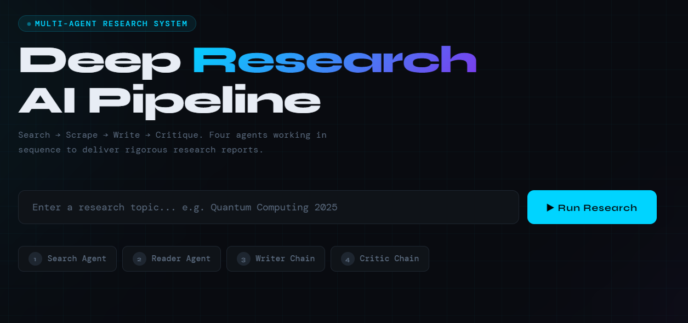
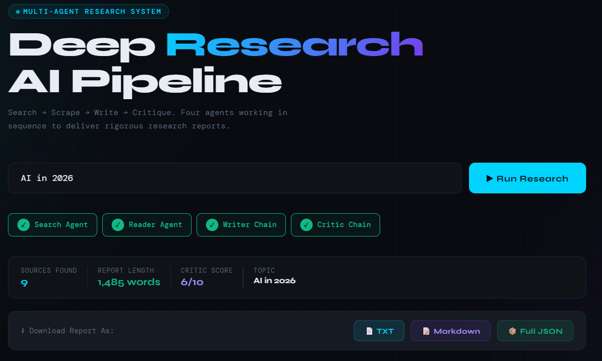
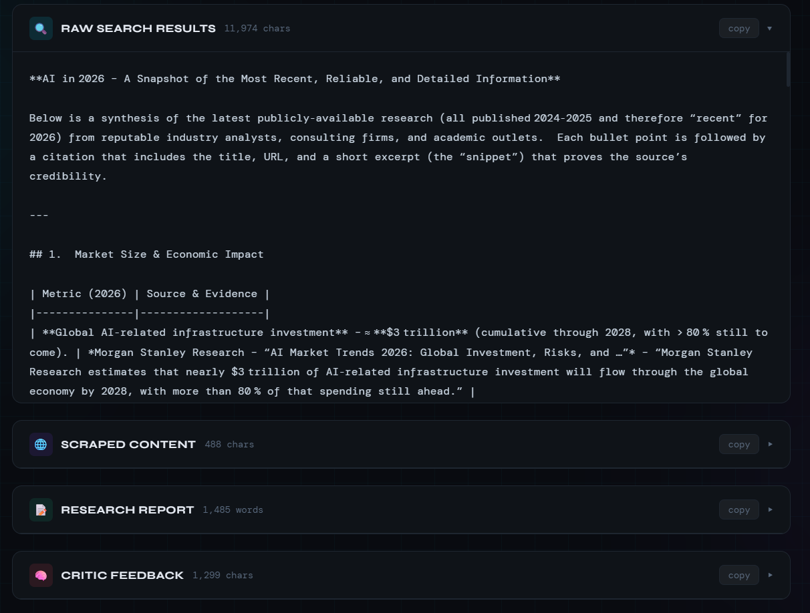

# 🔬 Deep Research AI Pipeline

<div align="center">

**A powerful multi-agent AI system that performs deep research automatically — Search → Scrape → Write → Critique.**

🌐 **[Live Demo → https://deepresearchagent-vx8g.onrender.com/](https://deepresearchagent-vx8g.onrender.com/)**

</div>

---

## 📌 Table of Contents

- [Overview](#-overview)
- [Features](#-features)
- [How It Works](#-how-it-works)
- [Multi-Agent Architecture](#-multi-agent-architecture)
- [Tech Stack](#-tech-stack)
- [Project Structure](#-project-structure)
- [Installation & Setup](#-installation--setup)
- [Usage](#-usage)
- [Deployment on Render](#-deployment-on-render)
- [Screenshots](#-screenshots)
- [Contributing](#-contributing)

---

## 🧠 Overview

**Deep Research AI Pipeline** is an intelligent, automated research system powered by a chain of specialized AI agents. Instead of manually browsing the web, reading articles, and summarizing findings — this system does it all for you in a structured, reliable pipeline.

Just enter a research topic and the system returns a **comprehensive, sourced, and critiqued research report** within minutes.

---

## ✨ Features

- 🔍 **Automated Web Search** — Finds the most relevant sources for your topic
- 🌐 **Intelligent Web Scraping** — Reads and extracts content from real web pages
- ✍️ **AI Report Writing** — Synthesizes findings into a structured, readable report
- 🧠 **AI Critic Review** — Evaluates the report quality and provides a score
- 📊 **Live Stats** — Tracks sources found, report length, and critic score in real-time
- 📥 **Multiple Export Formats** — Download results as TXT, Markdown, or Full JSON
- 🔗 **Sources & Links Panel** — View all raw search results and scraped content
- ⚡ **Real-time Progress UI** — Step-by-step agent progress displayed live

---

## ⚙️ How It Works

The system runs a **sequential 4-agent pipeline**:

```
User Input (Topic)
        ↓
┌───────────────────┐
│  1. Search Agent  │  → Searches the web for relevant sources
└────────┬──────────┘
         ↓
┌───────────────────┐
│  2. Reader Agent  │  → Scrapes and reads content from URLs
└────────┬──────────┘
         ↓
┌───────────────────┐
│  3. Writer Chain  │  → Synthesizes content into a research report
└────────┬──────────┘
         ↓
┌───────────────────┐
│  4. Critic Chain  │  → Reviews the report and gives a quality score
└───────────────────┘
         ↓
  Final Research Report (with sources, score, export options)
```

---

## 🤖 Multi-Agent Architecture

| Agent | Role | Description |
|-------|------|-------------|
| **Search Agent** | Information Retrieval | Queries the web using search APIs to find relevant, authoritative sources on the given topic |
| **Reader Agent** | Content Extraction | Scrapes and parses the content of discovered web pages, filtering noise and extracting key information |
| **Writer Chain** | Report Generation | Uses a large language model to synthesize extracted content into a well-structured, coherent research report |
| **Critic Chain** | Quality Assessment | Independently evaluates the generated report for accuracy, completeness, and clarity — providing a numeric score and feedback |

---

## 🛠 Tech Stack

### Backend
- **Python** — Core language
- **FastAPI**  — Web framework for serving the application
- **LangChain / Custom Agent Framework** — For orchestrating multi-agent pipelines
- **OpenAI API / LLM** — Powers the Writer and Critic chains
- **BeautifulSoup / Playwright / Requests** — Web scraping and content extraction
- **Tavily** — Search agent backend

### Frontend
- **HTML5 / CSS3 / JavaScript** — Clean, responsive UI
- **Fetch API** — Real-time pipeline status updates

### Deployment
- **Render** — Cloud hosting platform
- **Gunicorn / Uvicorn** — Production WSGI/ASGI server

---

## 📁 Project Structure

```
MULTIAGENTSYSTEM/
│
├── screenshots/              # Project screenshots
├── templates/                # HTML templates (Jinja2/Flask)
│
├── agents.py                 # All agent definitions (Search, Reader, Writer, Critic)
├── main.py                   # Application entry point & route handling
├── pipeline.py               # Multi-agent pipeline orchestration logic
├── tools.py                  # Utility tools used by agents (search, scrape, etc.)
│
├── .env                      # Environment variables (API keys) — not committed
├── .gitignore                # Files and folders ignored by Git
├── render.yaml               # Render deployment configuration
├── requirements.txt          # Python dependencies
├── start.sh                  # Shell script to start the app on Render
└── README.md                 # Project documentation
```

---

## 🚀 Installation & Setup

### Prerequisites

- Python 3.9+
- An OpenAI API key (or compatible LLM provider)
- (Optional) SerpAPI key for enhanced search

### 1. Clone the Repository

```bash
git clone https://github.com/YOUR_USERNAME/deep-research-agent.git
cd deep-research-agent
```

### 2. Create a Virtual Environment

```bash
python -m venv venv
source venv/bin/activate        # On Windows: venv\Scripts\activate
```

### 3. Install Dependencies

```bash
pip install -r requirements.txt
```

### 4. Set Environment Variables

Create a `.env` file in the root directory:

```env
OPENAI_API_KEY=your_openai_api_key_here
SERPAPI_KEY=your_serpapi_key_here        # Optional
```

### 5. Run the Application

```bash
python app.py
```

Visit `http://localhost:5000` (or your configured port) in your browser.

---

## 📖 Usage

1. **Open the app** at [https://deepresearchagent-vx8g.onrender.com/](https://deepresearchagent-vx8g.onrender.com/)
2. **Enter a research topic** in the input field (e.g., *"Impact of AI on healthcare in 2024"*)
3. **Click "Run Research"** to start the pipeline
4. **Watch the agents work** — progress is shown step by step:
   - 🔍 Search Agent finds sources
   - 🌐 Reader Agent scrapes content
   - ✍️ Writer Chain generates the report
   - 🧠 Critic Chain reviews it
5. **View your report** in the output panel
6. **Export** as TXT, Markdown, or JSON

---

## ☁️ Deployment on Render

This project is deployed on **[Render](https://render.com)**, a modern cloud platform.

### Steps followed for deployment:

1. **Push code to GitHub** — Linked the GitHub repository to Render

2. **Create a New Web Service** on Render dashboard:
   - Select "Web Service"
   - Connect GitHub repo
   - Set build command: `pip install -r requirements.txt`
   - Set start command: `gunicorn app:app` (or `uvicorn app:app --host 0.0.0.0 --port $PORT`)

3. **Add Environment Variables** in Render dashboard:
   - `OPENAI_API_KEY`
   - `SERPAPI_KEY` (if used)

4. **Deploy** — Render automatically builds and deploys on every push to `main`

5. **Live URL**: [https://deepresearchagent-vx8g.onrender.com/](https://deepresearchagent-vx8g.onrender.com/)

> ⚠️ **Note:** On the free tier, Render spins down the service after inactivity. The first request may take 30–60 seconds to wake up.

---

## 📸 Screenshots



### 🏠 Home Page — Research Input
> Enter your research topic and hit **Run Research** to kick off the multi-agent pipeline.

> *Live app: [https://deepresearchagent-vx8g.onrender.com/](https://deepresearchagent-vx8g.onrender.com/)*

---

### ⚡ Pipeline Running — Agent Progress
> The 4-step agent pipeline runs in sequence with real-time status indicators.

```
Step 1 → Search Agent     [✅ Complete]
Step 2 → Reader Agent     [⏳ In Progress...]
Step 3 → Writer Chain     [⏸ Waiting]
Step 4 → Critic Chain     [⏸ Waiting]
```

---

### 📊 Results Dashboard
> After pipeline completion, view stats including:
> - **Sources Found** — Number of web pages retrieved
> - **Report Length** — Word count of generated report
> - **Critic Score** — Quality rating from the Critic Agent
> - **Topic** — The researched subject

---

### 📥 Export Options
> Download your research report in multiple formats:
> - 📄 **TXT** — Plain text
> - 📝 **Markdown** — Formatted for GitHub/Notion
> - 📦 **Full JSON** — Complete pipeline data with sources

---

> **💡 Tip:** To add real screenshots, take screenshots of the live app at [https://deepresearchagent-vx8g.onrender.com/](https://deepresearchagent-vx8g.onrender.com/), save them in a `screenshots/` folder, and update the image links above like:
> ```markdown
> 
> ```

---

## 🤝 Contributing

Contributions are welcome! Feel free to:

1. Fork the repository
2. Create a new branch (`git checkout -b feature/your-feature`)
3. Commit your changes (`git commit -m 'Add some feature'`)
4. Push to the branch (`git push origin feature/your-feature`)
5. Open a Pull Request

---

## 📄 License

This project is licensed under the MIT License. See the [LICENSE](LICENSE) file for details.

---

<div align="center">

Made with ❤️ | Deployed on [Render](https://render.com)

🌐 **[https://deepresearchagent-vx8g.onrender.com/](https://deepresearchagent-vx8g.onrender.com/)**

</div>
